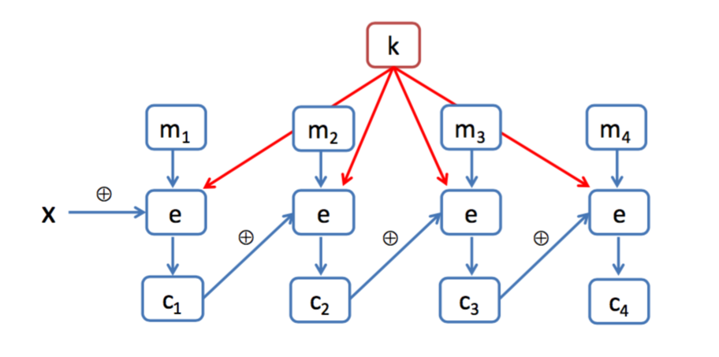

# Cryptography

Nowadays, there are two main classes of symmetric encryption techniques (i.e. ciphers where both keys of the sender and receiver are the same): _stream ciphers_ and _block ciphers_. We can also distinguish between "symmetric private-key cryptography" (i.e. where keys are private but equal for both communicating parties) and "asymmetric public-private key cryptography" (i.e. where a key is public and the other is private).

## Stream Ciphers

One symbol in the plain text is convert into a symbol of cipher text. Examples of stream ciphers, shift ciphers, substitution ciphers, one-time pad.

## Block Ciphers

The message to be encrypted is processed in blocks of k bits. For example, if k = 64, then the message is broken into 64-bit blocks, and each block is encrypted independently. To encode a block, the cipher uses a one-to-one mapping to map the k-bit block of cleartext to a k-bit block of ciphertext

## Cipher Block Chaining

Idea: use previous blocks in the encryption of the current block. Encryption is not just based on the current block, but on the entire message up to the current block.

### Encryption

### Decryption

CBC solve the problem of any two equal blocks within a message being encrypted in the same way (as in a normal block cipher). So, in this kind of cryptography system, equal blocks within a message are encrypted in a different, but identical messages still produce the same final cipher text. We need to add randomness to this protocol to make it more secure...

## What is Secrecy?

A scheme is secret if we can learn nothing about the original from the cipher text.

More formally, given a set of keys $K$, for two messages $m_1 \neq m_2$, for any ciphertext $c$, then we have $$P_{k \in K} \left[ e(m_1, k) = c\right]=P_{k \in K} \left[ e(m_2, k) = c\right]$$

In other words, given $c$, every plain text is equiprobable.

The one-time pad algorithm provides perfect secracy, but it has a drawback: the key used in the encryption and decryption of the algorithm must be as big as the message itself.

## TODO

- A block cipher algorithm
    - a cipher block chaining     
- A substitution cipher
- RSA

## Reading and watching Suggestions

- [Journey into cryptography](https://www.khanacademy.org/computing/computer-science/cryptography), a course by Khan Academy

- [Cryptography I](https://www.coursera.org/course/crypto), a course by Coursera/Stanford

- [Cryptography](https://en.wikipedia.org/wiki/Cryptography), an article by Wikipedia

- [Computer Networking: A Top-Down Approach](http://www.amazon.com/Computer-Networking-Top-Down-Approach-Edition/dp/0132856204), a book by Kurose and Ross (6th ed.)

